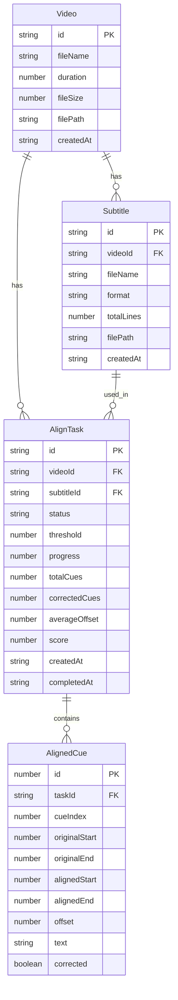

## 1. 架构设计

```mermaid
flowchart TB
    subgraph "前端层 Frontend"
        "Vue3 应用"
        "时间轴拖拽组件"
        "视频播放器组件"
        "波形可视化"
    end

    subgraph "后端层 Backend (Node.js Express)"
        "文件上传 API"
        "字幕解析 API"
        "对齐任务 API"
        "校准历史 API"
        "任务队列管理"
    end

    subgraph "AI处理层 Python Service"
        "FFmpeg 音频提取"
        "VAD 语音活动检测"
        "字幕对齐算法"
    end

    subgraph "数据层 Data"
        "SQLite 数据库"
        "文件存储 (uploads/)"
    end

    "Vue3 应用" --> "文件上传 API"
    "Vue3 应用" --> "字幕解析 API"
    "Vue3 应用" --> "对齐任务 API"
    "Vue3 应用" --> "校准历史 API"
    "文件上传 API" --> "文件存储 (uploads/)"
    "对齐任务 API" --> "任务队列管理"
    "任务队列管理" --> "Python Service"
    "Python Service" --> "FFmpeg 音频提取"
    "FFmpeg 音频提取" --> "VAD 语音活动检测"
    "VAD 语音活动检测" --> "字幕对齐算法"
    "字幕对齐算法" --> "SQLite 数据库"
    "校准历史 API" --> "SQLite 数据库"
```

## 2. 技术说明

- 前端：Vue3@3 + TypeScript + Vite + TailwindCSS + vue-router
- 初始化工具：vite-init (vue-express-ts 模板)
- 后端：Express@4 + TypeScript (ESM)
- Python服务：独立子进程调用，使用 webrtcvad + FFmpeg 进行VAD
- 数据库：SQLite (better-sqlite3)
- 文件存储：本地文件系统 (uploads/ 目录)

## 3. 路由定义

| 路由 | 用途 |
|------|------|
| / | 工作台主页面 - 文件上传、视频预览、时间轴编辑、字幕列表 |
| /history | 校准历史页面 - 历史记录列表、搜索筛选、详情查看 |

## 4. API 定义

### 4.1 文件上传

```typescript
// POST /api/upload/video
// Content-Type: multipart/form-data
interface UploadVideoRequest {
  file: File; // MP4/MKV/AVI
}
interface UploadVideoResponse {
  videoId: string;
  fileName: string;
  duration: number;
  fileSize: number;
}

// POST /api/upload/subtitle
// Content-Type: multipart/form-data
interface UploadSubtitleRequest {
  file: File; // SRT/ASS
  videoId: string;
}
interface UploadSubtitleResponse {
  subtitleId: string;
  format: "srt" | "ass";
  totalLines: number;
  cues: SubtitleCue[];
}

interface SubtitleCue {
  index: number;
  startTime: number; // 毫秒
  endTime: number;   // 毫秒
  text: string;
}
```

### 4.2 对齐校准

```typescript
// POST /api/align
interface AlignRequest {
  videoId: string;
  subtitleId: string;
  threshold: number; // 偏移阈值，默认200ms
}
interface AlignResponse {
  taskId: string;
  status: "processing" | "completed" | "failed";
  result?: AlignResult;
}

interface AlignResult {
  totalCues: number;
  correctedCues: number;
  averageOffset: number;
  score: number; // 0-100
  cues: AlignedCue[];
}

interface AlignedCue {
  index: number;
  originalStart: number;
  originalEnd: number;
  alignedStart: number;
  alignedEnd: number;
  offset: number;     // 原始偏移量(ms)
  text: string;
  corrected: boolean; // 是否被自动修正
}

// GET /api/align/:taskId
interface AlignStatusResponse {
  taskId: string;
  status: "processing" | "completed" | "failed";
  progress: number; // 0-100
  result?: AlignResult;
}
```

### 4.3 手动校准

```typescript
// PUT /api/align/:taskId/cues/:cueIndex
interface ManualCalibrateRequest {
  alignedStart: number;
  alignedEnd: number;
}
interface ManualCalibrateResponse {
  success: boolean;
  cue: AlignedCue;
}
```

### 4.4 导出

```typescript
// GET /api/export/:taskId?format=srt|ass
// Response: 文件下载流
```

### 4.5 校准历史

```typescript
// GET /api/history?page=1&limit=20
interface HistoryResponse {
  total: number;
  page: number;
  items: HistoryItem[];
}

interface HistoryItem {
  id: string;
  videoName: string;
  subtitleName: string;
  createdAt: string;
  correctedCues: number;
  totalCues: number;
  score: number;
}

// GET /api/history/:id
interface HistoryDetailResponse extends AlignResult {
  id: string;
  videoName: string;
  subtitleName: string;
  createdAt: string;
}

// POST /api/history/:id/reload
// 将历史记录重新加载到工作台
interface ReloadResponse {
  videoId: string;
  subtitleId: string;
  taskId: string;
  result: AlignResult;
}
```

## 5. 服务端架构图

```mermaid
flowchart LR
    "Router 路由层" --> "Controller 控制层"
    "Controller 控制层" --> "Service 服务层"
    "Service 服务层" --> "Repository 数据层"
    "Service 服务层" --> "Python 子进程"
    "Python 子进程" --> "FFmpeg"
    "Python 子进程" --> "webrtcvad"
    "Repository 数据层" --> "SQLite"
```

## 6. 数据模型

### 6.1 数据模型定义



### 6.2 数据定义语言

```sql
CREATE TABLE videos (
    id TEXT PRIMARY KEY,
    fileName TEXT NOT NULL,
    duration REAL NOT NULL,
    fileSize INTEGER NOT NULL,
    filePath TEXT NOT NULL,
    createdAt TEXT NOT NULL DEFAULT (datetime('now'))
);

CREATE TABLE subtitles (
    id TEXT PRIMARY KEY,
    videoId TEXT NOT NULL REFERENCES videos(id) ON DELETE CASCADE,
    fileName TEXT NOT NULL,
    format TEXT NOT NULL CHECK(format IN ('srt', 'ass')),
    totalLines INTEGER NOT NULL,
    filePath TEXT NOT NULL,
    createdAt TEXT NOT NULL DEFAULT (datetime('now'))
);

CREATE TABLE align_tasks (
    id TEXT PRIMARY KEY,
    videoId TEXT NOT NULL REFERENCES videos(id) ON DELETE CASCADE,
    subtitleId TEXT NOT NULL REFERENCES subtitles(id) ON DELETE CASCADE,
    status TEXT NOT NULL DEFAULT 'processing' CHECK(status IN ('processing', 'completed', 'failed')),
    threshold INTEGER NOT NULL DEFAULT 200,
    progress INTEGER NOT NULL DEFAULT 0,
    totalCues INTEGER NOT NULL DEFAULT 0,
    correctedCues INTEGER NOT NULL DEFAULT 0,
    averageOffset REAL NOT NULL DEFAULT 0,
    score REAL NOT NULL DEFAULT 0,
    createdAt TEXT NOT NULL DEFAULT (datetime('now')),
    completedAt TEXT
);

CREATE TABLE aligned_cues (
    id INTEGER PRIMARY KEY AUTOINCREMENT,
    taskId TEXT NOT NULL REFERENCES align_tasks(id) ON DELETE CASCADE,
    cueIndex INTEGER NOT NULL,
    originalStart INTEGER NOT NULL,
    originalEnd INTEGER NOT NULL,
    alignedStart INTEGER NOT NULL,
    alignedEnd INTEGER NOT NULL,
    offset INTEGER NOT NULL,
    text TEXT NOT NULL,
    corrected INTEGER NOT NULL DEFAULT 0
);

CREATE INDEX idx_subtitles_videoId ON subtitles(videoId);
CREATE INDEX idx_align_tasks_videoId ON align_tasks(videoId);
CREATE INDEX idx_align_tasks_subtitleId ON align_tasks(subtitleId);
CREATE INDEX idx_align_tasks_status ON align_tasks(status);
CREATE INDEX idx_aligned_cues_taskId ON aligned_cues(taskId);
```
