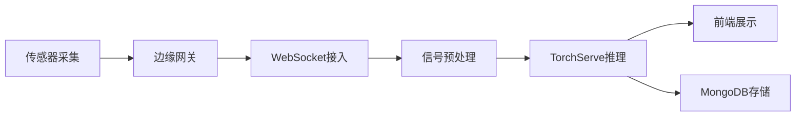

## 1. 产品概述

工业设备故障诊断系统，通过分析设备传感器上传的10kHz采样率振动时序数据，使用预训练的1D-CNN深度学习模型实时识别设备运行状态，包括正常、轴承故障、齿轮故障、不平衡四类状态。系统为工业运维人员提供实时监测和离线批量分析能力，帮助提前发现设备故障隐患。

- 解决工业设备预防性维护中的故障早期识别问题
- 目标用户：工业运维工程师、设备管理人员、数据分析人员
- 产品价值：降低设备 downtime、减少维护成本、提高生产安全性

## 2. 核心功能

### 2.1 用户角色

| 角色 | 注册方式 | 核心权限 |
|------|----------|----------|
| 运维工程师 | 系统分配账号 | 实时监测、查看诊断历史、导出报告 |
| 系统管理员 | 系统分配账号 | 用户管理、模型管理、系统配置 |

### 2.2 功能模块

1. **实时监测面板**：实时波形图展示、设备状态分类结果、异常告警
2. **离线分析中心**：批量文件上传、批量诊断、结果导出
3. **诊断历史记录**：历史查询、统计图表、趋势分析
4. **设备管理**：设备列表、设备配置、传感器管理

### 2.3 页面详情

| 页面名称 | 模块名称 | 功能描述 |
|----------|----------|----------|
| 实时监测面板 | 波形图展示 | WebSocket实时推送振动数据波形，支持缩放、暂停 |
| 实时监测面板 | 分类结果卡片 | 显示当前诊断状态（四类）、置信度、时间戳 |
| 实时监测面板 | 告警通知 | 异常状态高亮显示、声音提醒 |
| 离线分析中心 | 文件上传 | 支持CSV/Parquet格式批量文件上传 |
| 离线分析中心 | 任务列表 | 显示批量分析任务进度和结果 |
| 诊断历史记录 | 历史列表 | 按时间、设备、状态筛选查询 |
| 诊断历史记录 | 统计图表 | 故障类型分布、设备健康趋势 |
| 设备管理 | 设备列表 | 设备信息配置、传感器参数设置 |

## 3. 核心流程

### 3.1 实时诊断流程

传感器采集振动信号 → 边缘网关上传数据 → WebSocket流式接入 → 信号预处理（去噪、切片）→ TorchServe模型推理 → 分类结果返回前端 → MongoDB持久化存储

### 3.2 离线分析流程

用户上传批量数据文件 → 后端接收并存入临时存储 → 创建批量分析任务 → 异步任务调度 → 逐条预处理和推理 → 结果汇总生成报告 → 用户下载查看

## 4. 用户界面设计

### 4.1 设计风格

- 主色调：工业蓝（#165DFF）+ 深灰背景（#0F172A），体现专业可靠的工业系统风格
- 辅助色：正常（#00B42A）、警告（#FF7D00）、故障（#F53F3F）
- 按钮风格：直角边框、扁平化设计，状态色区分
- 字体：JetBrains Mono（数据展示）+ PingFang SC（中文）
- 布局：左侧导航栏 + 顶部状态栏 + 主内容区的经典工业监控布局
- 图标：Font Awesome 工业类图标，保持统一线性风格

### 4.2 页面设计概述

| 页面名称 | 模块名称 | UI元素 |
|----------|----------|--------|
| 实时监测面板 | 波形图区域 | 深色背景、亮色波形曲线、网格线、时间轴 |
| 实时监测面板 | 状态卡片 | 大字号状态显示、环形置信度进度条、状态色边框 |
| 实时监测面板 | 告警列表 | 时间序列、红色高亮异常项、滑动动画 |
| 离线分析中心 | 上传区域 | 拖拽上传、文件列表、进度条 |
| 诊断历史记录 | 统计图表 | ECharts饼图/折线图、渐变色填充 |
| 设备管理 | 设备卡片 | 网格布局、设备状态指示灯、快捷操作按钮 |

### 4.3 响应式

- Desktop-first 设计，主屏幕适配 1920x1080 监控大屏
- 平板端：导航栏可折叠，波形图自适应宽度
- 移动端：单列布局，核心数据卡片优先展示，图表简化

### 4.4 可视化设计

- 波形图使用 Canvas 绘制，支持百万级数据点流畅渲染
- 状态变化时使用平滑过渡动画（0.3s ease-in-out）
- 告警推送时使用脉冲动画效果提醒用户
- 数据加载使用骨架屏占位，提升感知性能
