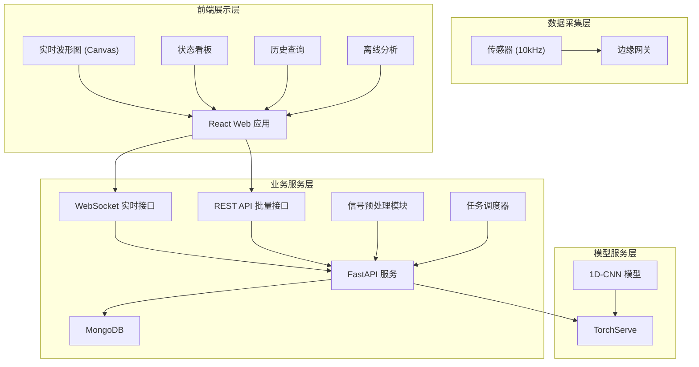
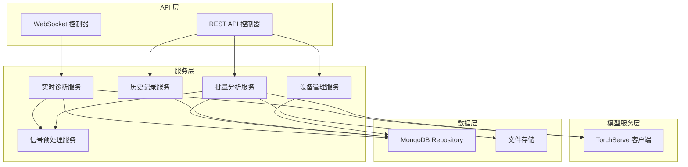
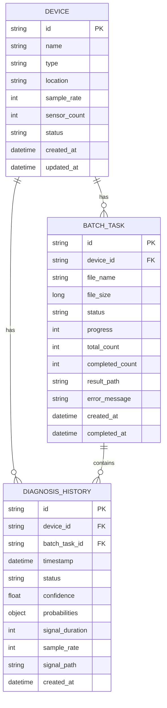

## 1. 架构设计

系统采用分层架构设计，分为数据采集层、模型服务层、业务服务层和前端展示层。



## 2. 技术栈描述

- **前端**：React@18 + TypeScript + Vite + TailwindCSS@3 + ECharts + Axios
- **后端**：Python 3.10 + FastAPI + Uvicorn + PyMongo + Celery
- **模型服务**：PyTorch 2.0 + TorchServe
- **数据处理**：NumPy + SciPy + Pandas
- **数据库**：MongoDB 6.0+
- **消息队列**：Redis（用于Celery任务队列）
- **实时通信**：WebSocket (FastAPI WebSocket)

## 3. 路由定义

| 路由 | 方法 | 用途 |
|------|------|------|
| `/` | GET | 首页（重定向到实时监测） |
| `/realtime` | GET | 实时监测面板 |
| `/offline` | GET | 离线分析中心 |
| `/history` | GET | 诊断历史记录 |
| `/devices` | GET | 设备管理 |
| `/api/v1/diagnosis/realtime` | WS | WebSocket 实时诊断接口 |
| `/api/v1/diagnosis/batch` | POST | 创建批量分析任务 |
| `/api/v1/diagnosis/batch/{task_id}` | GET | 查询批量任务状态 |
| `/api/v1/diagnosis/batch/{task_id}/download` | GET | 下载批量分析结果 |
| `/api/v1/history` | GET | 查询诊断历史列表 |
| `/api/v1/history/{id}` | GET | 获取单条诊断详情 |
| `/api/v1/devices` | GET/POST | 设备列表/创建设备 |
| `/api/v1/devices/{id}` | GET/PUT/DELETE | 设备详情/更新/删除 |

## 4. API 定义

### 4.1 类型定义

```typescript
// 设备状态枚举
enum DeviceStatus {
  NORMAL = 'normal',
  BEARING_FAULT = 'bearing_fault',
  GEAR_FAULT = 'gear_fault',
  IMBALANCE = 'imbalance'
}

// 诊断结果
interface DiagnosisResult {
  id: string;
  deviceId: string;
  timestamp: number;
  status: DeviceStatus;
  confidence: number;
  probabilities: Record<DeviceStatus, number>;
  signalDuration: number;
  sampleRate: number;
}

// 实时数据流
interface RealtimeData {
  timestamp: number;
  signal: number[];
  diagnosis?: DiagnosisResult;
}

// 批量任务
interface BatchTask {
  id: string;
  fileName: string;
  fileSize: number;
  status: 'pending' | 'processing' | 'completed' | 'failed';
  progress: number;
  totalCount: number;
  completedCount: number;
  createdAt: number;
  completedAt?: number;
  resultUrl?: string;
}

// 设备信息
interface Device {
  id: string;
  name: string;
  type: string;
  location: string;
  sampleRate: number;
  sensorCount: number;
  status: 'online' | 'offline' | 'maintenance';
  createdAt: number;
}
```

### 4.2 WebSocket 接口

**连接地址**: `ws://{host}/api/v1/diagnosis/realtime?deviceId={deviceId}`

**上行消息（客户端→服务器）**:
```json
{
  "type": "signal_data",
  "deviceId": "dev_001",
  "timestamp": 1717200000000,
  "signal": [0.012, -0.003, 0.021, ...]
}
```

**下行消息（服务器→客户端）**:
```json
{
  "type": "diagnosis_result",
  "data": {
    "id": "diag_abc123",
    "deviceId": "dev_001",
    "timestamp": 1717200000000,
    "status": "normal",
    "confidence": 0.987,
    "probabilities": {
      "normal": 0.987,
      "bearing_fault": 0.005,
      "gear_fault": 0.004,
      "imbalance": 0.004
    }
  }
}
```

### 4.3 REST API 响应格式

```typescript
interface ApiResponse<T> {
  code: number;
  message: string;
  data: T;
}

interface PaginatedResponse<T> {
  items: T[];
  total: number;
  page: number;
  pageSize: number;
}
```

## 5. 服务器架构图



## 6. 数据模型

### 6.1 数据模型定义



### 6.2 MongoDB 集合定义

```javascript
// devices 集合
db.createCollection("devices", {
  validator: {
    $jsonSchema: {
      bsonType: "object",
      required: ["name", "type", "location", "sampleRate"],
      properties: {
        name: { bsonType: "string" },
        type: { bsonType: "string" },
        location: { bsonType: "string" },
        sampleRate: { bsonType: "int", minimum: 1000 },
        sensorCount: { bsonType: "int", minimum: 1 },
        status: { enum: ["online", "offline", "maintenance"] },
        createdAt: { bsonType: "date" },
        updatedAt: { bsonType: "date" }
      }
    }
  }
});
db.devices.createIndex({ name: 1 }, { unique: true });

// diagnosis_history 集合
db.createCollection("diagnosis_history", {
  timeseries: {
    timeField: "timestamp",
    metaField: "metadata",
    granularity: "seconds"
  }
});
db.diagnosis_history.createIndex({ "metadata.deviceId": 1, timestamp: -1 });
db.diagnosis_history.createIndex({ status: 1 });

// batch_tasks 集合
db.createCollection("batch_tasks", {
  validator: {
    $jsonSchema: {
      bsonType: "object",
      required: ["deviceId", "fileName", "fileSize"],
      properties: {
        deviceId: { bsonType: "string" },
        fileName: { bsonType: "string" },
        fileSize: { bsonType: "long" },
        status: { enum: ["pending", "processing", "completed", "failed"] },
        progress: { bsonType: "int", minimum: 0, maximum: 100 },
        resultPath: { bsonType: "string" },
        createdAt: { bsonType: "date" },
        completedAt: { bsonType: "date" }
      }
    }
  }
});
db.batch_tasks.createIndex({ deviceId: 1, createdAt: -1 });
db.batch_tasks.createIndex({ status: 1 });
```
