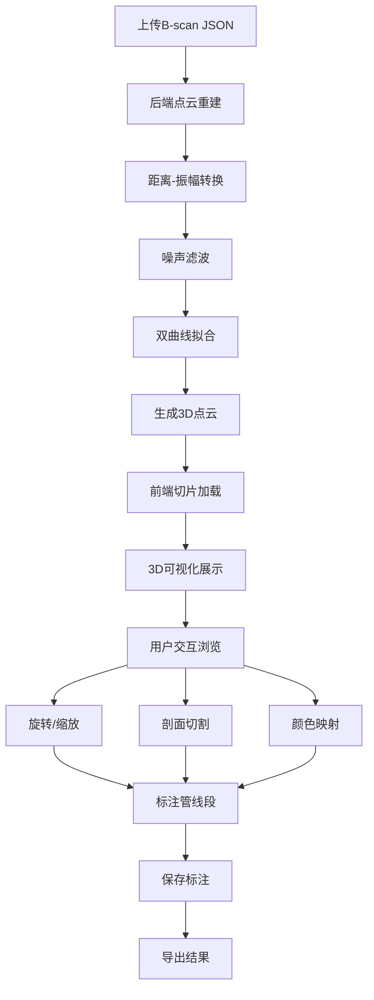

## 1. 产品概述

地下管线探地雷达点云重建与3D可视化系统，面向市政工程与地下管线探测人员，将探地雷达（GPR）扫描生成的B-scan数据自动重建为3D点云模型，并通过交互式Web界面进行可视化、剖切与标注，提升地下管线识别与管理的效率。

- 核心价值：将原始雷达信号自动转换为直观的3D管线模型，大幅降低人工判读难度
- 目标用户：市政管线探测工程师、物探数据处理人员、地下空间管理决策者

## 2. 核心功能

### 2.1 用户角色

| 角色 | 注册方式 | 核心权限 |
|------|----------|----------|
| 工程师 | 账号密码注册 | 上传数据、查看点云、标注管线、导出结果 |
| 管理员 | 后台分配 | 管理用户、审核标注、系统配置 |

### 2.2 功能模块

1. **数据上传页**：B-scan JSON文件上传、数据预览、重建参数配置
2. **点云可视化页**：3D点云渲染、旋转/缩放/剖切、管线标注、图层控制

### 2.3 页面详情

| 页面名称 | 模块名称 | 功能描述 |
|----------|----------|----------|
| 数据上传页 | 文件上传区 | 拖拽上传B-scan JSON文件，支持多文件批量上传 |
| 数据上传页 | 参数配置面板 | 介电常数、滤波窗口、拟合阈值等重建参数调整 |
| 数据上传页 | 数据预览区 | 上传后显示B-scan波形预览图 |
| 点云可视化页 | 3D视口 | Three.js渲染点云模型，支持轨道旋转、滚轮缩放、剖面切割 |
| 点云可视化页 | 剖切控制面板 | XYZ三轴剖切滑块，实时裁切点云 |
| 点云可视化页 | 标注工具栏 | 矩形/多边形标注，标注颜色/标签管理，标注列表 |
| 点云可视化页 | 图层面板 | 点云图层开关、颜色映射切换、透明度调节 |
| 点云可视化页 | 信息面板 | 当前选中标注详情、管线参数、导出按钮 |

## 3. 核心流程

用户上传B-scan JSON数据 → 后端执行点云重建（距离-振幅转换 → 噪声滤波 → 双曲线拟合）→ 前端加载3D点云 → 用户交互浏览（旋转/缩放/剖切）→ 用户标注疑似管线段 → 标注保存至数据库 → 导出标注结果

## 4. 用户界面设计

### 4.1 设计风格

- 主色调：深蓝灰（#1A2332）+ 科技青（#00E5CC）高亮，营造地质探测的科技感
- 辅助色：琥珀橙（#FF8C42）用于标注高亮，警戒红（#FF4757）用于异常标记
- 按钮：圆角矩形，微发光边框，hover时发光增强
- 字体：思源黑体（Noto Sans SC）用于界面文本，JetBrains Mono用于数据数值
- 布局：左侧工具面板 + 中央3D视口 + 右侧信息面板
- 图标：线性风格（Phosphor Icons），与科技青色调一致

### 4.2 页面设计概览

| 页面名称 | 模块名称 | UI元素 |
|----------|----------|--------|
| 数据上传页 | 文件上传区 | 拖拽虚线框、文件列表、进度条、深色卡片 |
| 数据上传页 | 参数配置面板 | 滑块+数值输入、预设方案下拉、重置按钮 |
| 数据上传页 | 数据预览区 | Canvas波形图、热力色彩映射、坐标轴标注 |
| 点云可视化页 | 3D视口 | 全屏Three.js画布、轨道控制器、网格地面 |
| 点云可视化页 | 剖切控制面板 | 三轴滑块、剖切平面可视化、重置按钮 |
| 点云可视化页 | 标注工具栏 | 图标按钮组、颜色选择器、标签输入框 |
| 点云可视化页 | 图层面板 | 开关列表、颜色条、透明度滑块 |
| 点云可视化页 | 信息面板 | 标注列表卡片、参数表格、导出按钮 |

### 4.3 响应式设计

- 桌面优先设计，1920×1080为基准分辨率
- 最小支持1366×768，3D视口自适应缩放
- 面板可折叠收起以增加视口面积

### 4.4 3D场景设计

- 环境：深色空间背景，微弱星空粒子营造地下探测氛围
- 灯光：环境光（冷白）+ 方向光（暖白），模拟地下探照灯效果
- 相机：透视相机，默认45°俯视角度，轨道控制器支持自由旋转
- 点云渲染：PointsMaterial + 自定义着色器，按深度/振幅渐变着色
- 剖切：ClippingPlane实时裁切，剖切面半透明显示
- 交互：射线拾取标注点、BoxHelper框选标注区域
