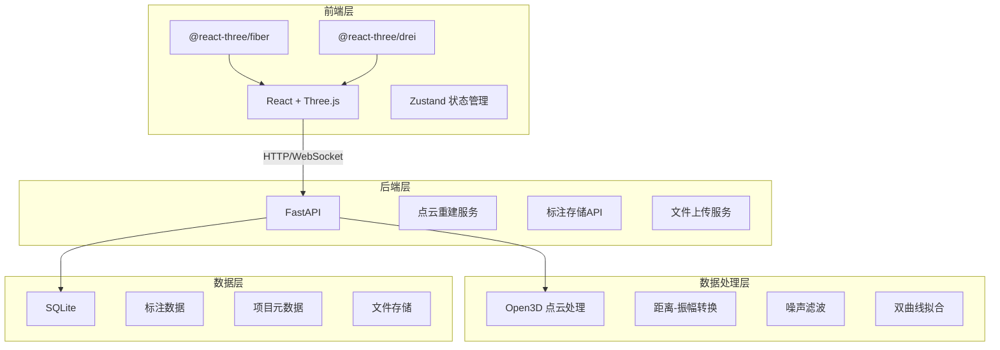
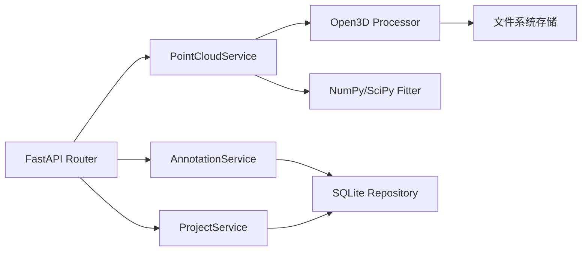
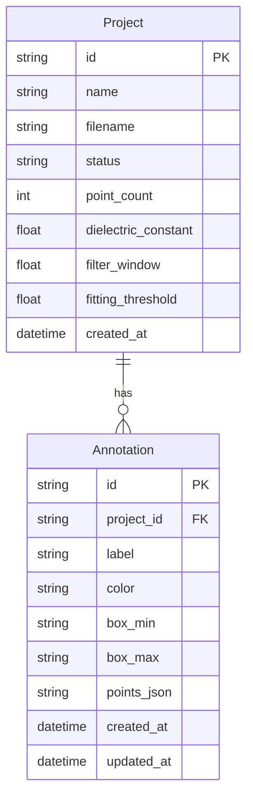

## 1. 架构设计



## 2. 技术说明

- 前端：React@18 + Three.js + @react-three/fiber + @react-three/drei + Zustand + Vite
- 初始化工具：Vite
- 后端：Python FastAPI + Open3D + NumPy + SciPy
- 数据库：SQLite（标注存储 + 项目元数据）
- 通信：REST API + JSON

## 3. 路由定义

| 路由 | 用途 |
|------|------|
| / | 数据上传与项目管理首页 |
| /viewer/:projectId | 点云3D可视化页面 |

## 4. API定义

### 4.1 数据上传

```typescript
POST /api/projects
Content-Type: multipart/form-data
Request: { file: File, params: ReconstructionParams }
Response: { project_id: string, status: "processing" }

interface ReconstructionParams {
  dielectric_constant: number;
  filter_window_size: number;
  fitting_threshold: number;
  velocity: number;
}
```

### 4.2 项目状态查询

```typescript
GET /api/projects/:projectId/status
Response: {
  project_id: string;
  status: "processing" | "completed" | "failed";
  progress: number;
  point_count: number;
  bounding_box: { min: [number,number,number], max: [number,number,number] };
}
```

### 4.3 点云数据切片加载

```typescript
GET /api/projects/:projectId/pointcloud?slice_index=0&slice_count=8
Response: {
  slice_index: number;
  total_slices: number;
  points: number[];
  colors: number[];
  bounds: { min: [number,number,number], max: [number,number,number] };
}
```

### 4.4 标注CRUD

```typescript
POST /api/projects/:projectId/annotations
Request: {
  label: string;
  color: string;
  points: [number,number,number][];
  box_min: [number,number,number];
  box_max: [number,number,number];
}
Response: { annotation_id: string }

GET /api/projects/:projectId/annotations
Response: Annotation[]

PUT /api/projects/:projectId/annotations/:annotationId
Request: Partial<Annotation>
Response: { annotation_id: string }

DELETE /api/projects/:projectId/annotations/:annotationId
Response: { success: boolean }

interface Annotation {
  id: string;
  project_id: string;
  label: string;
  color: string;
  points: [number,number,number][];
  box_min: [number,number,number];
  box_max: [number,number,number];
  created_at: string;
  updated_at: string;
}
```

### 4.5 B-scan预览

```typescript
GET /api/projects/:projectId/bscan-preview
Response: {
  traces: number;
  samples_per_trace: number;
  time_range: [number, number];
  amplitude_range: [number, number];
  image_base64: string;
}
```

## 5. 服务架构图



## 6. 数据模型

### 6.1 数据模型定义



### 6.2 数据定义语言

```sql
CREATE TABLE projects (
    id TEXT PRIMARY KEY,
    name TEXT NOT NULL,
    filename TEXT NOT NULL,
    status TEXT DEFAULT 'processing',
    point_count INTEGER DEFAULT 0,
    dielectric_constant REAL DEFAULT 6.0,
    filter_window REAL DEFAULT 5.0,
    fitting_threshold REAL DEFAULT 0.3,
    created_at TIMESTAMP DEFAULT CURRENT_TIMESTAMP
);

CREATE TABLE annotations (
    id TEXT PRIMARY KEY,
    project_id TEXT NOT NULL REFERENCES projects(id) ON DELETE CASCADE,
    label TEXT NOT NULL,
    color TEXT DEFAULT '#FF8C42',
    box_min TEXT NOT NULL,
    box_max TEXT NOT NULL,
    points_json TEXT DEFAULT '[]',
    created_at TIMESTAMP DEFAULT CURRENT_TIMESTAMP,
    updated_at TIMESTAMP DEFAULT CURRENT_TIMESTAMP
);

CREATE INDEX idx_annotations_project ON annotations(project_id);
```
